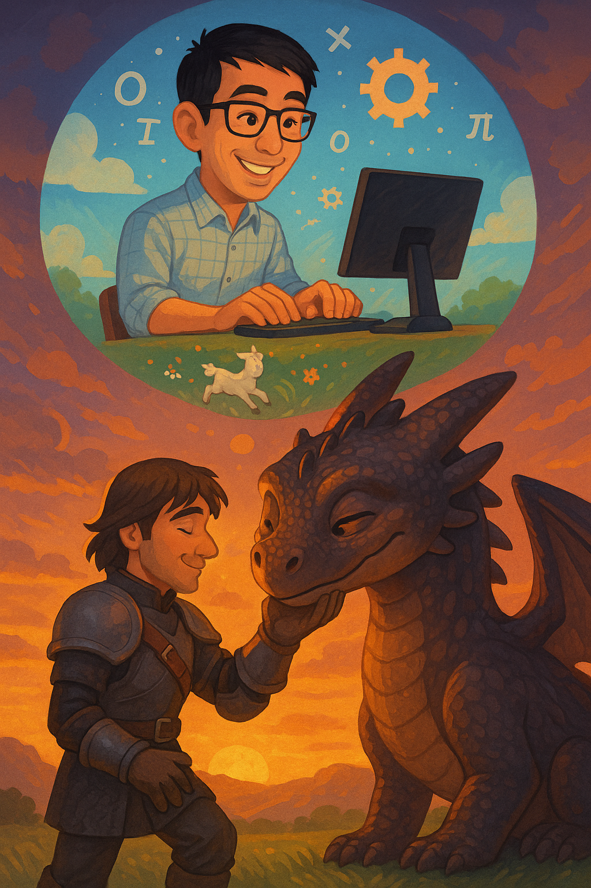

# ideal-palm-tree
The LLM Finetuning Playground repository.

This GitHub repo is a companion resource to the articles:
1. [How to Train Your LLM: Teaching Toothless to Bite](https://medium.com/@tituslhy/how-to-train-your-llm-teaching-toothless-to-bite-8d9f56fe4b2a)
2. An article on RAFT (upcoming)

<p align="center">
    
</p>

## Content
In our notebooks folder, we discuss how to develop a training dataset and finetune an LLM in different ways - supervised finetuning and retrieval augmented finetuning.
```
.
| - notebooks
|   - 1a. training_dataset_gen.ipynb        <- Codes to generate our training dataset
|   - 1b. finetune_llama32_1bn.ipynb        <- Codes to finetune Llama 3.2 1bn!
|   - 2. llama32_1bn_RAFT.ipynb             <- Codes to finetune Llama 3.2 1bn using the RAFT recipe!
```

## Setup
```
uv sync
```

